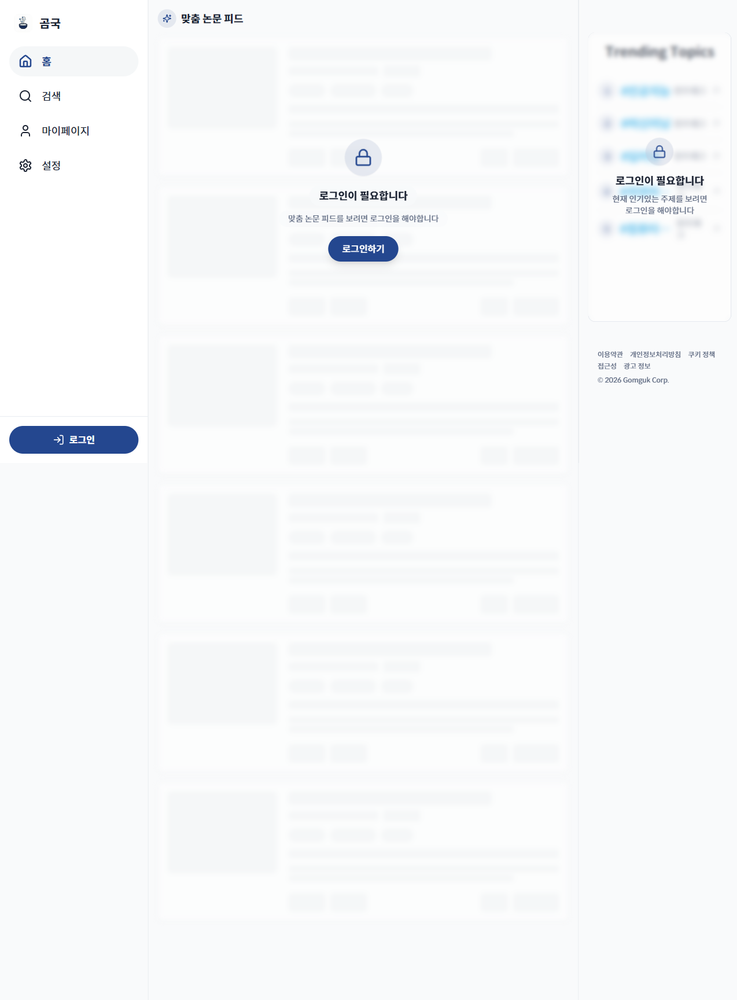
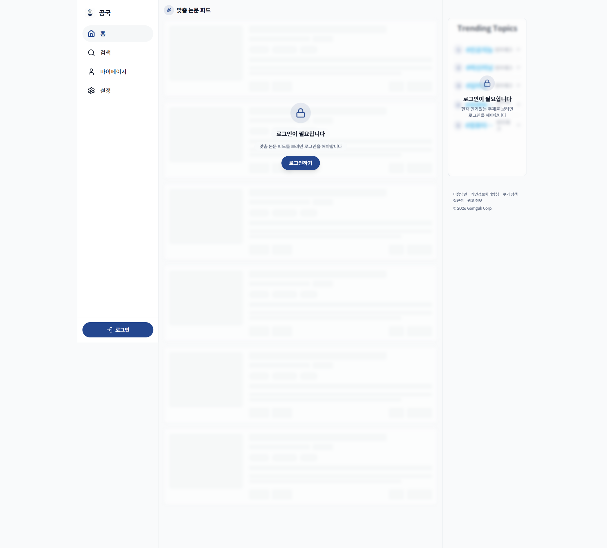
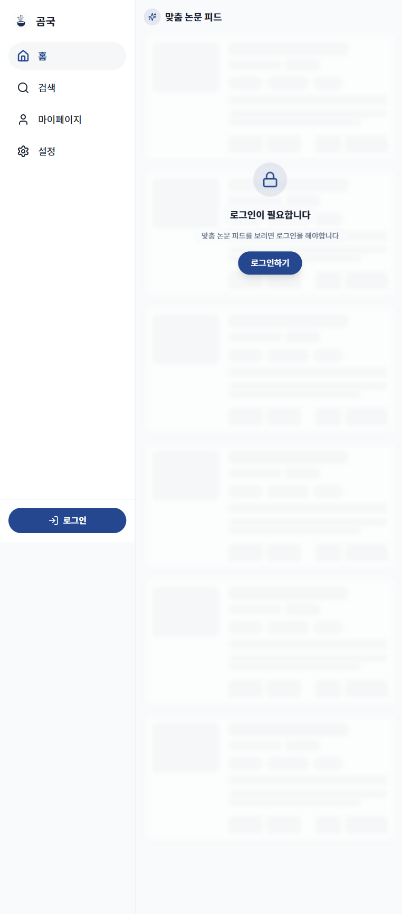
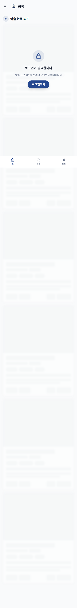
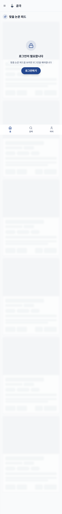
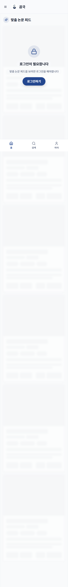

# TC-01: 홈 — 전체 뷰포트 레이아웃

**Status**: PASS
**Date**: 2026-04-07
**URL Tested**: https://gomguk.cloud/

## Requirement
6가지 화면 비율에서 사이드바/하단탭 전환 및 콘텐츠 overflow 없음

## Steps Executed
1. 1280×800, 1920×1080, 768×1024, 430×932, 390×844, 360×800 순으로 resize 후 홈 접속
2. 네비게이션 방식 확인 (사이드바 vs 하단탭바)
3. 요소 잘림·겹침·가로 스크롤 여부 확인

## Evidence

## Result
모든 뷰포트에서 레이아웃 정상 표시. 768px 이상에서는 좌측 사이드바, 767px 이하에서는 상단 헤더 + 하단 탭바(홈/검색/마이)로 전환됨. 가로 스크롤 없음.

## Notes
- 1920px에서 콘텐츠 영역이 화면 중앙에 고정되고 좌우 여백이 넓음. 의도적인 max-width 설계로 보이며 레이아웃 깨짐은 아님.
- 우측 사이드바 "Trending Topics"는 1280px 이상에서만 표시됨.
