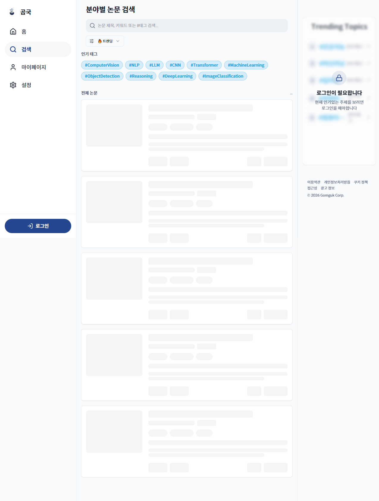
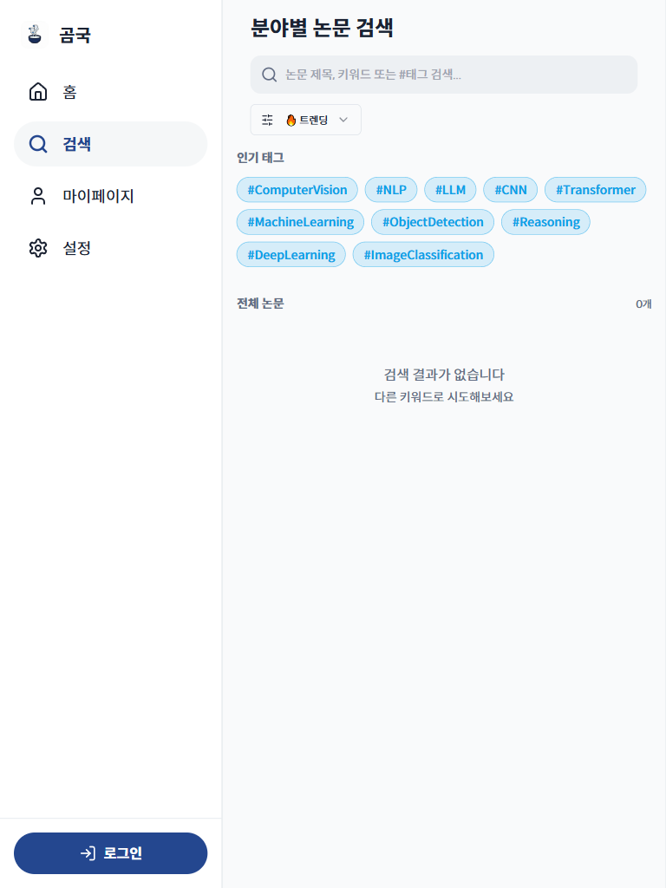
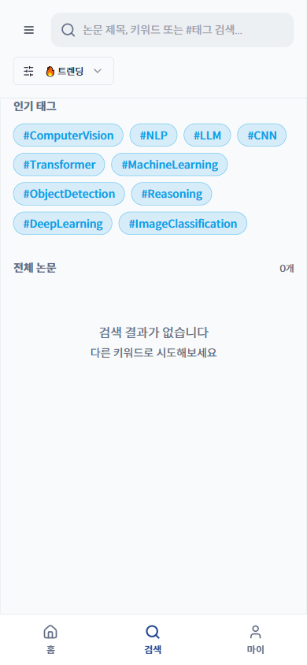

# TC-02: 검색 페이지 — 전체 뷰포트 레이아웃

**Status**: PASS
**Date**: 2026-04-07
**URL Tested**: https://gomguk.cloud/search

## Requirement
검색바, 태그 필터, 논문 목록이 모든 화면 크기에서 정상 표시

## Steps Executed
1. 1280×800, 1920×1080, 768×1024, 390×844, 360×800 순으로 resize 후 /search 접속
2. 검색바 너비, 인기 태그 줄바꿈, 논문 카드 영역 확인

## Evidence

## Result
모든 뷰포트에서 레이아웃 정상. 검색바는 뷰포트에 맞게 늘어남. 인기 태그는 자연스럽게 줄바꿈됨. 가로 스크롤 없음.

## Notes
- 비로그인 상태에서 기본 논문 목록 로딩 시 API 401 에러로 "검색 결과가 없습니다" 표시됨 → TC-07에서 별도 기록.
- 360px 모바일에서 헤더 레이아웃이 다름: 검색바가 상단 헤더 영역에 인라인 배치됨.
