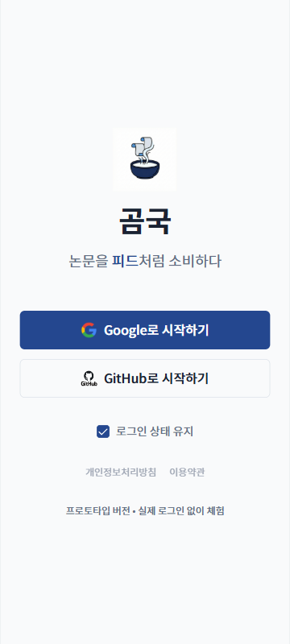

# TC-03: 로그인 페이지 — 전체 뷰포트 레이아웃

**Status**: PASS
**Date**: 2026-04-07
**URL Tested**: https://gomguk.cloud/login

## Requirement
로그인 카드가 모든 화면 크기에서 중앙 정렬, 버튼 잘림 없음

## Steps Executed
1. 1280×800, 360×800 resize 후 /login 접속
2. Google/GitHub 버튼, 체크박스, 약관 링크 위치 확인

## Evidence

## Result
모든 뷰포트에서 로그인 카드 중앙 정렬 유지. 버튼 텍스트 잘림 없음.

## Notes
- 개인정보처리방침, 이용약관 링크가 `[disabled]` 상태 + `href="#"` → TC-10에서 기록.
- 프로토타입 체험 텍스트는 클릭 불가 → TC-11에서 기록.
