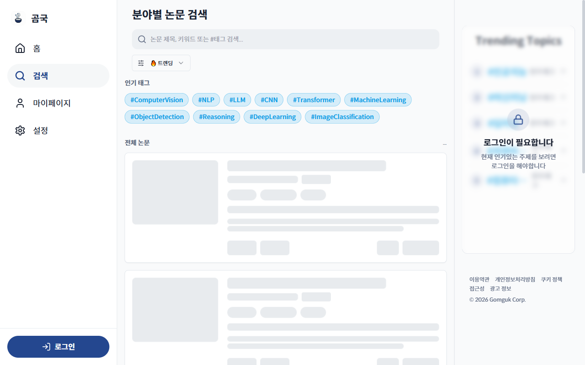
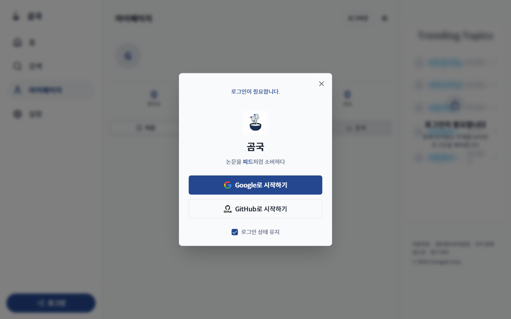
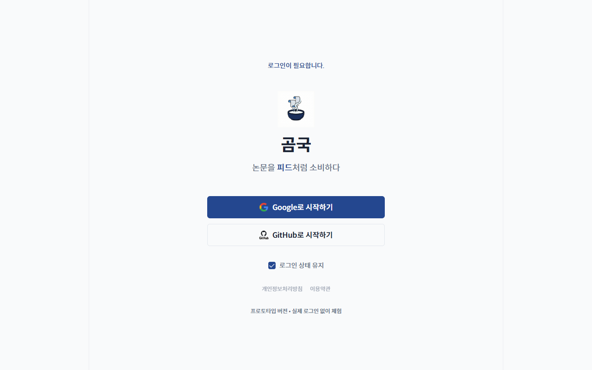

# TC-04: 사이드바 → 페이지 이동 (Desktop)

**Status**: PASS (with observation)
**Date**: 2026-04-07
**URL Tested**: https://gomguk.cloud/

## Requirement
사이드바의 홈/검색/마이페이지/설정 클릭 시 해당 페이지로 이동

## Steps Executed
1. 1280×800으로 홈 접속
2. 사이드바 [검색] 클릭 → URL 확인
3. 사이드바 [마이페이지] 클릭 → 동작 확인
4. 사이드바 [설정] 클릭 → 동작 확인

## Evidence

## Result
- [검색]: /search로 정상 이동, 사이드바에서 [검색] 활성화 ✅
- [마이페이지]: /mypage URL로 이동하며 로그인 모달 오버레이 표시 ✅
- [설정]: /login 페이지로 리다이렉트됨 (모달 아님)

## Notes
**UX 불일치**: 마이페이지는 로그인 모달(URL /mypage 유지), 설정은 /login 페이지로 리다이렉트. 동일한 인증 요구 상황에서 동작 방식이 다름.
