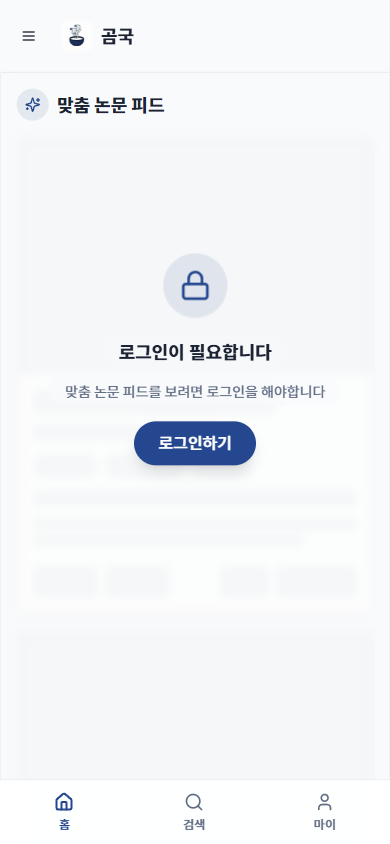
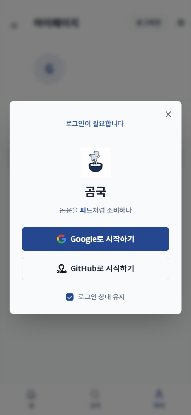

# TC-05: 하단 탭바 → 페이지 이동 (Mobile)

**Status**: PASS
**Date**: 2026-04-07
**URL Tested**: https://gomguk.cloud/

## Requirement
하단 탭(홈/검색/마이)이 모바일에서 정상 동작, 활성 탭 하이라이트

## Steps Executed
1. 390×844로 홈 접속
2. 하단 [검색] 탭 클릭
3. 하단 [마이] 탭 클릭

## Evidence

## Result
- 홈: 하단 탭바 표시, [홈] 아이콘 활성화 ✅
- [검색] 클릭: /search 이동, [검색] 탭 하이라이트 ✅
- [마이] 클릭: /mypage 이동, 로그인 모달 표시 ✅

## Notes
- 모바일 로그인 모달에서 개인정보처리방침/이용약관/프로토타입 체험 링크가 모달 하단에 잘려 보이지 않음. 스크롤 가능 여부 불명확.
