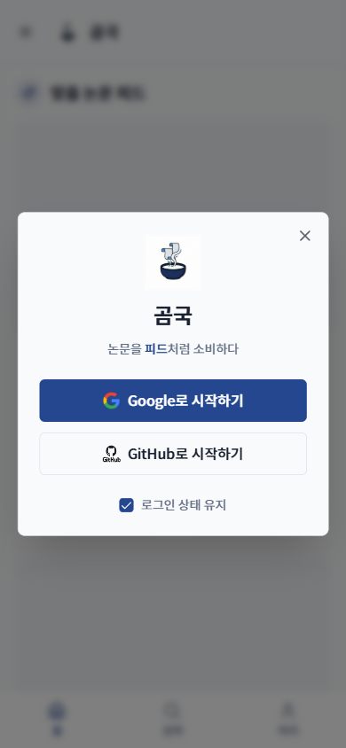

# TC-06: 홈 로그인하기 버튼 → 로그인 모달

**Status**: PASS
**Date**: 2026-04-07
**URL Tested**: https://gomguk.cloud/

## Requirement
비로그인 상태 홈에서 [로그인하기] 클릭 시 로그인 화면 표시

## Steps Executed
1. 390×844로 홈 접속
2. "로그인이 필요합니다" 섹션의 [로그인하기] 버튼 클릭

## Evidence

## Result
[로그인하기] 버튼 클릭 시 로그인 모달 표시. URL은 / 유지. Google/GitHub 버튼 정상 표시.

## Notes
- 모달이 뷰포트 하단에서 잘려 개인정보/약관 링크 미노출.
