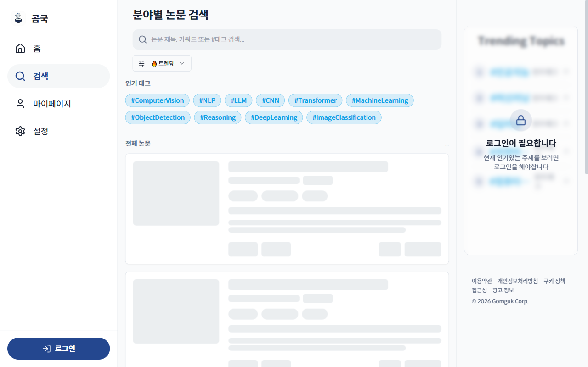
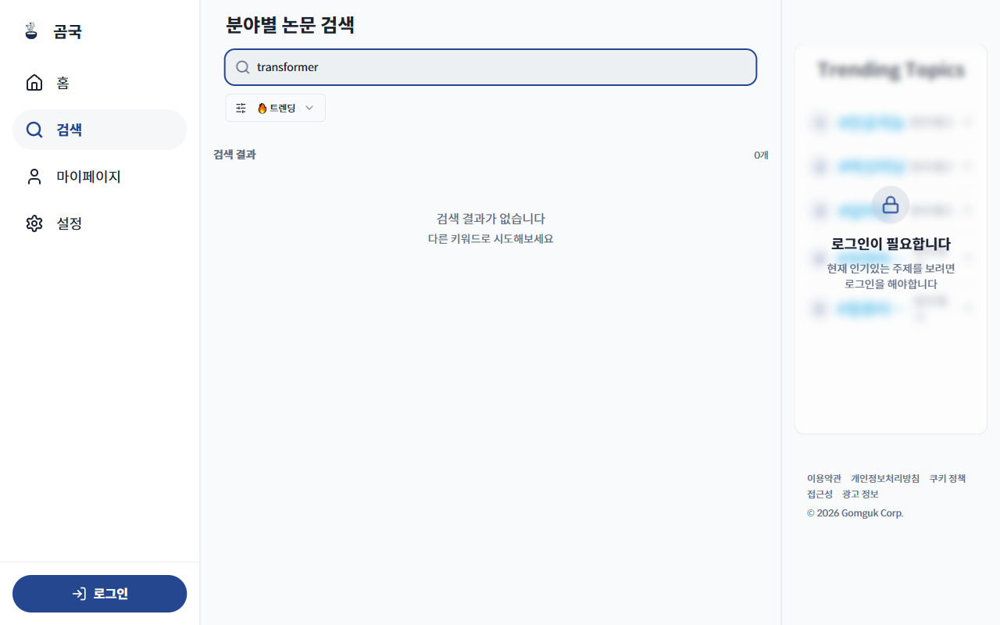

# TC-07: 검색어 입력 후 결과 표시

**Status**: FAIL
**Date**: 2026-04-07
**URL Tested**: https://gomguk.cloud/search

## Requirement
검색창에 키워드 입력 시 논문 목록이 필터링되어 표시됨

## Steps Executed
1. /search 접속
2. 검색창에 "transformer" 입력
3. 결과 확인 및 콘솔 에러 확인

## Evidence



## Result
**"transformer" 입력 후 "검색 결과가 없습니다 (0개)" 표시.**

콘솔 에러 확인 결과 API가 401 Unauthorized 반환:
```
GET /api/paper/?sort=popular&limit=20&offset=0&q=transformer → 401
GET /api/auth/refresh → 401 (토큰 갱신 시도 후 실패)
```

## Notes
- 비로그인 상태에서 논문 API 전체가 인증 필요 → 검색 결과 0개 표시
- **UX 문제**: "검색 결과가 없습니다"라는 메시지가 "로그인이 필요합니다"와 동일한 상황임에도 구분 없이 표시됨. 사용자가 검색어가 잘못된 것으로 오해할 수 있음.
- 개선 제안: 비인증 API 호출 실패 시 "로그인 후 검색 결과를 확인할 수 있습니다" 등의 안내 메시지 필요.
