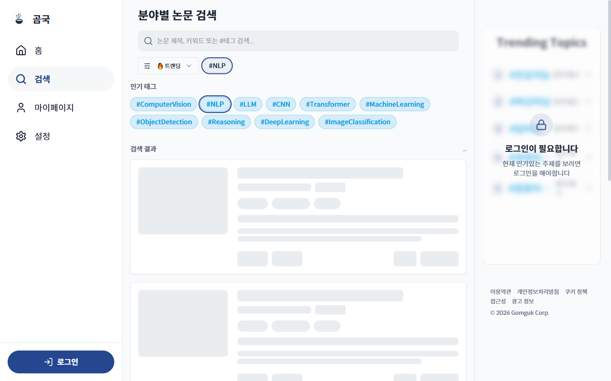

# TC-08: 인기 태그 클릭 → 필터 적용

**Status**: PASS (UI 동작 정상, 결과는 인증 필요로 0개)
**Date**: 2026-04-07
**URL Tested**: https://gomguk.cloud/search

## Requirement
인기 태그 클릭 시 해당 태그로 검색 필터 적용, URL 및 UI 반영

## Steps Executed
1. /search 접속
2. 인기 태그 [#NLP] 클릭
3. URL 변경 및 필터 배지 확인

## Evidence

## Result
- URL: /search → /search?tag=NLP ✅
- 필터 바에 [#NLP] 배지 표시 ✅
- 인기 태그 목록에서 #NLP 강조 표시 ✅
- 섹션명 "전체 논문" → "검색 결과"로 변경 ✅

## Notes
실제 검색 결과는 TC-07과 동일하게 401로 인해 0개.
