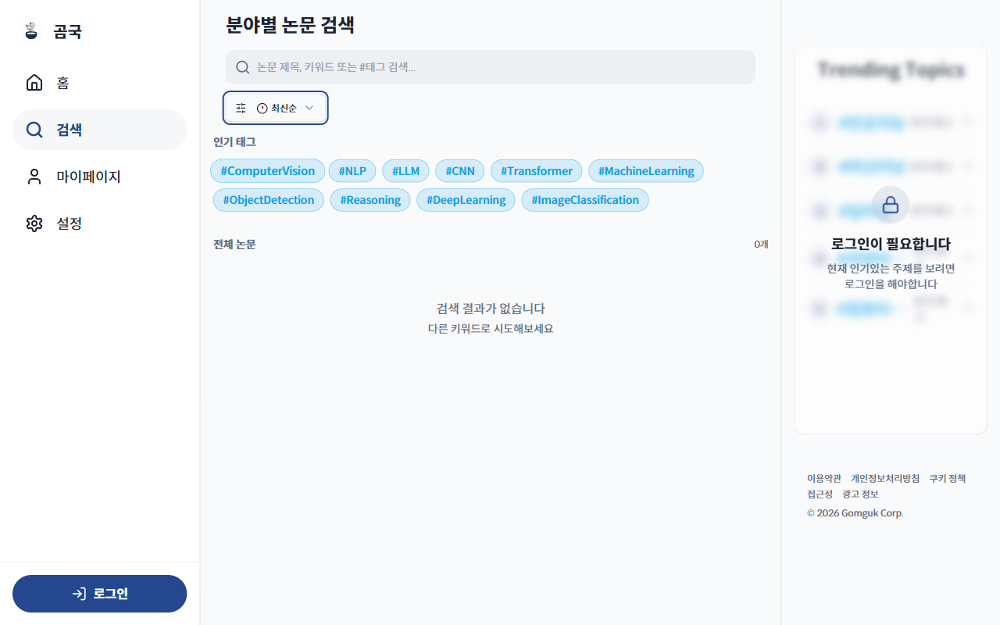

# TC-09: 정렬 필터 동작

**Status**: PASS (UI 동작 정상)
**Date**: 2026-04-07
**URL Tested**: https://gomguk.cloud/search

## Requirement
트렌딩/최신순/추천순 정렬 변경 시 드롭다운 UI 반영

## Steps Executed
1. /search 접속
2. [🔥 트렌딩] 드롭다운 클릭
3. 옵션 목록(트렌딩, 최신순, 추천순) 확인
4. [🕐 최신순] 선택

## Evidence

## Result
- 드롭다운 클릭 시 트렌딩/최신순/추천순 옵션 표시 ✅
- 최신순 선택 후 드롭다운 라벨 "🕐 최신순"으로 변경 ✅

## Notes
실제 정렬 결과 반영은 인증 필요로 확인 불가.
