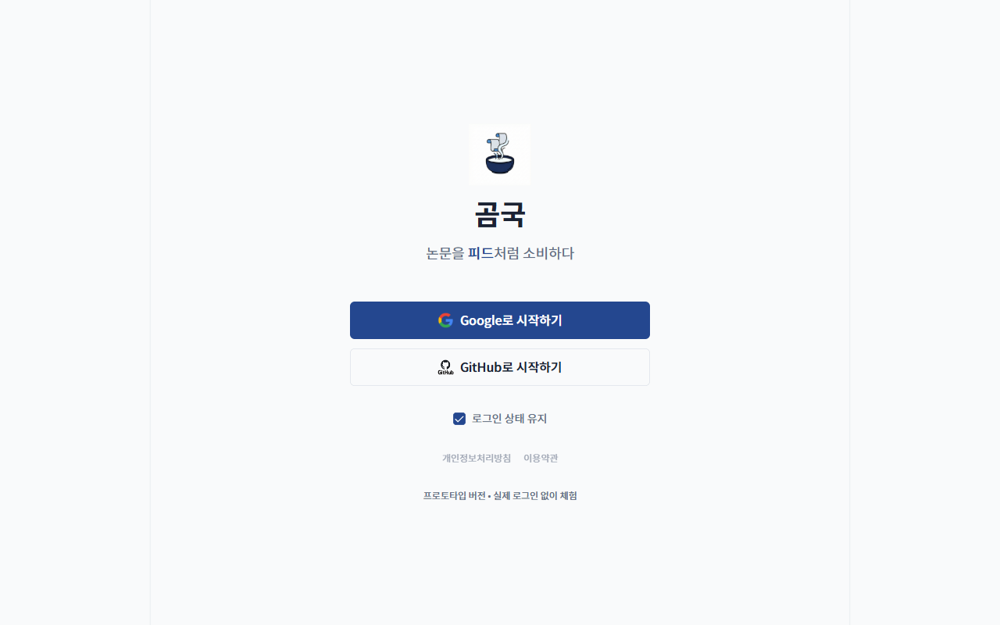

# TC-10: 로그인 페이지 요소 정상 표시

**Status**: FAIL
**Date**: 2026-04-07
**URL Tested**: https://gomguk.cloud/login

## Requirement
Google/GitHub 버튼, 체크박스, 약관 링크, 프로토타입 체험 링크 모두 정상 표시 및 동작

## Steps Executed
1. /login 접속
2. 스냅샷으로 각 요소 존재 및 상태 확인

## Evidence

## Result
- Google로 시작하기 버튼 ✅
- GitHub로 시작하기 버튼 ✅
- 로그인 상태 유지 체크박스 (기본 체크됨) ✅
- 개인정보처리방침 링크: **[disabled] + href="#"** ❌
- 이용약관 링크: **[disabled] + href="#"** ❌
- 프로토타입 체험 텍스트: 클릭 불가 paragraph 요소 ❌

## Notes
- 개인정보처리방침, 이용약관이 실제 페이지로 연결되지 않고 비활성화 상태.
- 접근성 측면에서도 링크처럼 보이지만 실제로 disabled 상태는 사용자 혼란 유발.
- 접근성 문구에 "Google 또는 **Kakao** 계정으로 로그인" 이라고 되어 있으나 실제 버튼은 **GitHub** — aria 텍스트 불일치.
