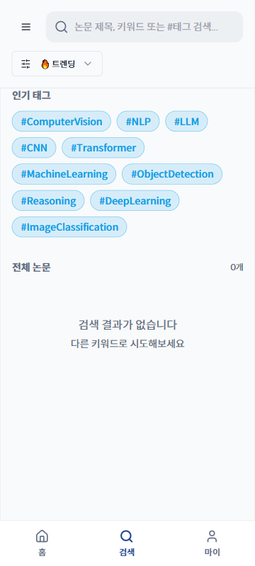

# TC-12: 매우 좁은 화면 (360px) — 텍스트 잘림 없음

**Status**: PASS
**Date**: 2026-04-07
**URL Tested**: https://gomguk.cloud/

## Requirement
360px에서 버튼 텍스트, 태그, 네비게이션 라벨 잘림 없음

## Steps Executed
1. 360×800으로 홈, 검색, 로그인 페이지 순차 확인

## Evidence

## Result
- 홈: 하단 탭 라벨(홈/검색/마이) 잘림 없음, 로그인 필요 메시지 정상 표시 ✅
- 검색: 인기 태그 자연스럽게 줄바꿈, 검색바 전체 너비 정상 ✅
- 로그인: Google/GitHub 버튼 텍스트 잘림 없음, 중앙 정렬 유지 ✅

## Notes
없음.
