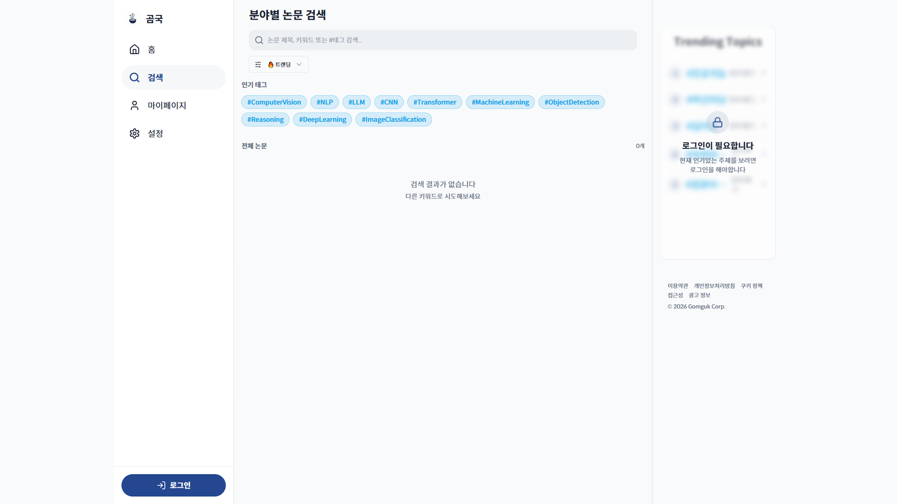

# TC-13: 넓은 화면 (1920px) — 콘텐츠 과도한 늘어남 없음

**Status**: PASS
**Date**: 2026-04-07
**URL Tested**: https://gomguk.cloud/

## Requirement
1920px에서 콘텐츠 영역이 과도하게 늘어나거나 레이아웃이 깨지지 않음

## Steps Executed
1. 1920×1080으로 홈, 검색 페이지 확인

## Evidence

## Result
- 홈: 콘텐츠 중앙 정렬 유지, 좌우 여백 균형 ✅
- 검색: 콘텐츠 영역이 가로로 적절히 확장됨 ✅
- 레이아웃 붕괴 없음 ✅

## Notes
홈 페이지에서 1920px 시 콘텐츠 컬럼이 화면 중앙 고정(max-width 제한)되어 좌우 여백이 매우 넓음. 디자인 의도로 보이나 넓은 화면에서 공간 활용도가 낮을 수 있음.
